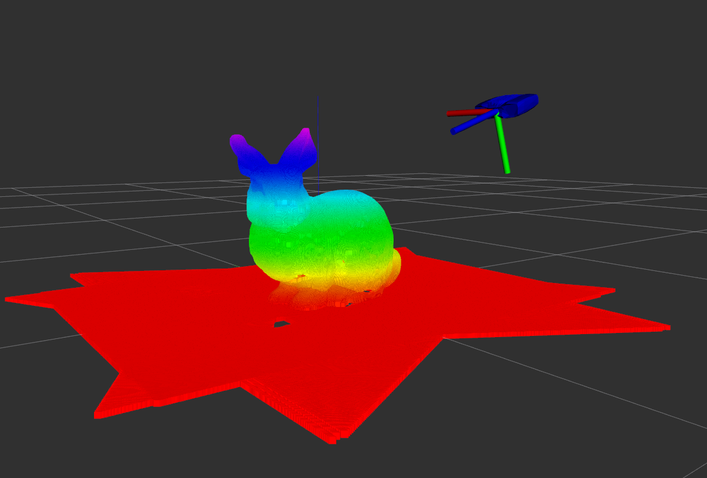
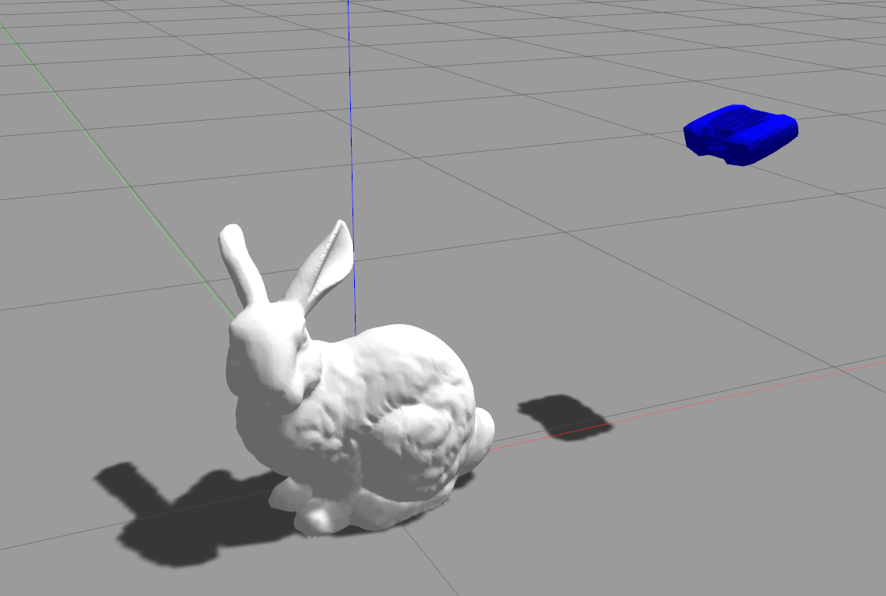

# Viewpoint Planning Package


## Overview

The `viewpoint_planning` package provides a ROS-based framework to spawn a sensor in a Gazebo simulation environment and capture depth and color images from various poses. This package includes the URDF model of the sensor, necessary plugins for depth and color image capturing, and a ROS service to manage the sensor's pose and data capture.

This package is meant a wrapper for simulating the results of algorithms desogn for solving the Coverage Viewpoint Problem.

<div style="display: flex; justify-content: space-between;">

  
</div>

## Features

- **URDF Model**: Detailed URDF model for the structured light sensor.
- **Gazebo Integration**: Simulate the sensor in a Gazebo environment with depth and color image capturing capabilities.
- **ROS Services**: Spawn the sensor at specified poses and capture sensor data.
- **TF Management**: Manage TF frames for accurate pose representation and data alignment.


## Installation

1. **Prerequisites**
   - ROS (Robot Operating System) Noetic
   - Gazebo
   - Necessary ROS dependencies
2. **Clone the Repository**
   ```sh
   cd ~/catkin_ws/src
   git clone https://github.com/FarStryke21/viewpoint_planning.git
3. **Build the package**
    ```sh
   cd ~/catkin_ws
    catkin build
    source devel/setup.bash

## Usage

1. **Launch Simulator**
   ```sh
   roslaunch viewpoint_planning viewpoint_test.launch
2. **Spawn the target model**

   Define the Gazebo model for your target object in the `gazebo_models` directory. Call the model using the appropriate rosservice.
   ```sh
   rosservice call /load_mesh "mesh_file: 'test_bunny'"
3. **Set initial pose**

    The pose of the sensor can be changed by sending request calls to `/gazebo/set_model_state`. Your viewpoint manager should send this service requests. You can also send service commands from a command line terminal or the Gazebo window. An example of pose sent to the sensor looking directly down is given here
    ```sh
   rosservice call /gazebo/set_model_state "model_state: 
    {
        model_name: 'structured_light_sensor_robot', 
        pose: 
        {
        position: 
        {
            x: 0, 
            y: 0, 
            z: 1.0
        }, 
        orientation: 
        {
            x: 0.0, 
            y: 1.0, 
            z: 0.0, 
            w: 0.0
        }
        }, 
        twist: 
        {
        linear: 
        {
            x: 0.0, 
            y: 0.0, 
            z: 0.0
        }, 
        angular: 
        {
            x: 0.0, 
            y: 0.0, 
            z: 0.0
        }
        }, 
        reference_frame: 'world'
    }"
4. **Capture the surface**

    Surface capture requesus can be mafe through the following rosservice:
    ```sh
   rosservice call /capture_surface 
    ```
    This publishes two pointclouds, `\current_measurement` which provides the last captured surface, and `\accumulated_surface` which provides the combined surface clouds. The messages are only published during service calls.

## Files and Directories


-   **urdf/**: Contains the URDF model files.
-   **launch/**: Contains launch files for starting the Gazebo simulation and RViz.
-   **meshes/**: Contains the mesh files for the sensor model.
-   **gazebo_models/**: Contains the gazebo model descriptions for the target objects.
-   **config/**: Contains configuration files for RViz and Gazebo.
-   **src/**: Contains the source code for the ROS package.
-   **srv/**: Contains the service descriptions for the ROS package.
-   **CMakeLists.txt**: CMake build script.
-   **package.xml**: Package manifest.


## Contact

For issues, questions, or contributions, please contact:

-   **Author**: Aman Chulawala 
-   **GitHub**: [FarStryke21](https://github.com/FarStryke21)


Contributions and feedback are always welcome!
